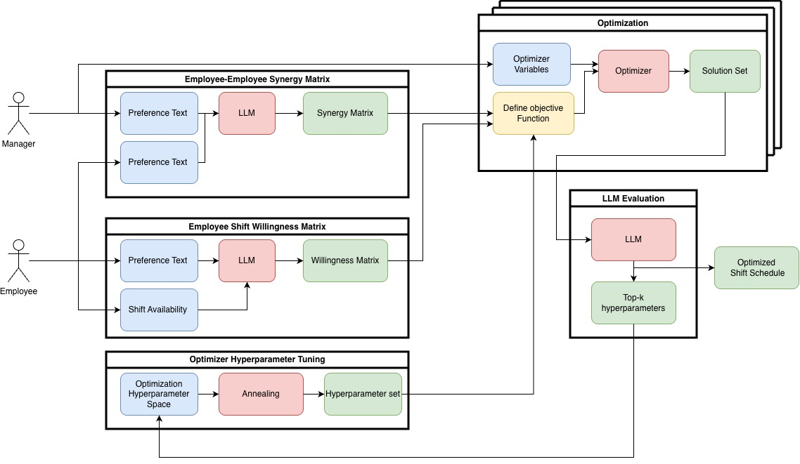

# Introduction - Problem Definition
- For managers at stores with a lot of employees, they need to make shift schedule every month.
- Followings are the factors that make this process challenging
	1. The number of employee can change from month to month
	2. Everyone may have different preference
	3. Individual employees' preferences may also change in time
	4. Manager needs to respect employees' preference as much as possible while being within domain rules
- Because the manager should respect employee's preference and availability as much as possible, considering all of the above mentioned makes the job extremely difficult and time-consuming.
- Also, this job needs to be repeated every month, which lowers the manager's efficiency.
- Automating this job can improve the workplace morale and increase manager's efficiency to overall reduce operating costs.

# Methodology

## Overview

| Module        | Technology stack                                  | Description                                                                                                        |
| ------------- | ------------------------------------------------- | ------------------------------------------------------------------------------------------------------------------ |
| Frontend      | React(JavaScript)<br>Django(Python)<br>PostgreSQL | Managers / Employee can enter their preference and availability using UI and natural language                      |
| LLM Extractor | Python<br>OpenAI API                              | LLM extracts individual preferences and converts them into constraints for the optimizer                                          |
| Optimizer     | Python<br>Pyomo<br>IPOPT (Solver)                 | Optimizer will generate optimized shift using information given by the Extractor                                 
| LLM Extractor | Python<br>OpenAI API                              | Multiple possible shifts are generated from optimizer. This module evaluates all of them and chooses the best one. |


## Frontend
Used **React(JavaScript)**, **Django(Python)** and **PostgreSQL** for implementation
- **Synergy**: People can explain with whom they want to work with using natural language
- **Availability**: People can input their availability in calendar

This information will be passed to LLM extractor.
## LLM Extractor
Used **Python**, **OpenAI API** and **fine-tuned** to fit the purpose
This module gets *Availability* and *Synergy* information as input and generates matrices for next module
- **ED-Matrix**: This matrix represents Availability between *Employee*, *Days*, and *Shifts*
	- 3rd dimensional matrix
- **EE-Matrix**: This matrix represents synergy between *Employee* and another *Employee*
	- 2nd dimensional matrix
## Optimizer
Used **Python** and **Pyomo** (Python package for solving mathematical optimization problem)
- This module is mathematical optimizer to solve optimization problem
- Implemented mathematical expression and function and solve the problem
### Primary Variables


- These variables are primary variables
- Primary variables are used to defining the problem
### Supplementary Variables
  

- These variables are used to explain **Primary Variables**
### Primary Variables (Matrices)
.svg)
### Decision Variables
  
- **Decision Variables** are matrices that would be generated as a result
- These would be the solution of provided problem
### Constraints
  
- **Constraints** are the rules the optimizer should obey
- Generated shift should fulfill every constraint
### Objective Function
**ED Loss**
  
EDLoss calculates:
	1. Element-wise difference between $M_{LLM, E, D, S}$ and $M_{sugg, E, D, S}$ add all the values and gets mean  
	2. Employee-wise cosine similarity between  $M_{LLM, E, D, S}$ and $M_{sugg, E, D, S}  
	3. Cosine similarity between  $M_{LLM, E, D, S}$ and $M_{sugg, E, D, S}  
And gets summation of all of terms calculated above

**EE Loss**  
  

EELoss calculates:
	1. Element-wise difference between $M_{LLM, E, E'}$ and $M_{sugg, E, E'}$ add all the values and gets mean  
	2. Employee-wise cosine similarity between  $M_{LLM, E, E'}$ and $M_{sugg, E, E'}  
	3. Cosine similarity between  $M_{LLM, E, E'}$ and $M_{sugg, E, E'}  
And gets summation of all of terms calculated above  
  
$\alpha$, $\beta$, $\gamma$ are weights which will be applied to each element of $EDLoss$ and $EELoss$
Coefficients are fixed as one by default

**Integrated Function**  

  

- Objective function calculates total loss value of $EDLoss$ and $EELoss$
- $Z_1$ and $Z_2$ are weights which will be applied to $EDLoss$ and $EELoss$
	- Coefficients are fixed as one by default

**Objective**  

 

The objective of this problem is:
- Find $M_{\text{sugg}, E, D, S}$ and $M_{\text{sugg}, E, E'}$ which minimize the $EDLoss$ and $EELoss$
- which follows all the pre-set constraints
## LLM Evaluator
- **Optimizer** generates multiple shift with multiple coefficients.
- **Evaluator** will evaluate all of them and choose the best one
# Discussion - Why We Chose This Structure?
## Why Not Machine Learning?
- Applying machine learning is ***possible*** but, there are some problems
- We did not have enough data to train the model
- Model may be settle in local optima while fitting
- It is computationally expensive, which is not applicable for project like this (which requires real time calculation)
## Why Not Purely LLM?
- LLMs are good at classifying given data into different categories
- But, LLMs have possibility to generate hallucinated results which is not intended output
	- This output can be *partially optimized solution* or ***not applicable at all***
- Lastly, there is a **blackbox problem**
	- We don't know what is going on inside LLMs which makes process opaque
	- For project like this, every information should be as transparent as possible
## Why We Combined LLMs And Optimization?
### LLMs
- As mentioned above, LLMs are good at classifying and can process natural language
- Therefore, LLMs can extract preferences from natural language and convert them into numbers
- When *fine-tuned* properly, hallucination can be minimized
### Mathematical Optimization
- Unlike LLMs or machine learning methods, mathematical optimization methods derives solution analytically
- This solution derived with these solvers are already proved that those are the best solutions for this.
- Therefore, we can ensure our solution is the best solution
- In case of open-sourced solvers, their algorithm is opened to public and everyone can check their algorithms
	- Therefore, the process is transparent and everyone can understand what is going on inside the box
# Limitations
- We are still relying on LLMs, and our solution still can be non-optimal solution
- We don't know how our **Evaluator** evaluates outputs, and choose best one **(Blackbox problem)**
- The coefficients we applied on our objective function are fixed
# Future Work
## Methodology

- Apply *Simulated Annealing (SA) method* or other metaheuristic method for hyper-parameter tuning
	- **Hyper-parameter tuning**: finding best coefficients for our model
	- This will substitute our **Evaluator** module
	- This will mitigate the **Blackbox problem**
- Apply iterative evaluation
	- After evaluate the output, **back-propagate** found hyper-parameters to optimizer and evaluate again
	- Iteration will be finished when it fulfills certain criteria or after it ran certain numbers of iterations
	- This will enhance the performance
- Apply XAIs (eXplainable AIs) for extracting preferences
	- This will mitigate the **Blackbox problem**
## Functionalities
- Employee can include secret requirements
	- This will be invisible for managers
	- This can include 1) the person who don't want to work with, 2) private information
- Dynamic constraints
	- Currently, constraints (pre-set rules) are fixed and cannot be changed
- Handles the situation where no feasible area exists by compromising constraints
	- Then inform managers about it after the process done
- Managers can edit the optimized shifts on an interactive UI
- Managers can edit user database
- The system can handle the information about which employees belong to which managers.
	- Currently, managers handle all the employee’s in database.
# Executing
- You need [Docker](https://www.docker.com/) and [Git](https://git-scm.com/downloads) to run the program
- Pull the repository by running following command in terminal
```bash
git clone git@github.com:PotatoPotato12345678/LLM_optimization.git
```
- Direct to the project directory in terminal
- Run following command in terminal
```bash
docker-compose up --build --remove-orphans
```
- Web server will start from:
```http
http://localhost:3000/
```
- Access to the address via web browser
- Enjoy!
# Authors
- **Ikuta** Toma
- **Lin** Chung-Hsi
- Tamjidur MD **Rahman**
- **Kim** Wonil
